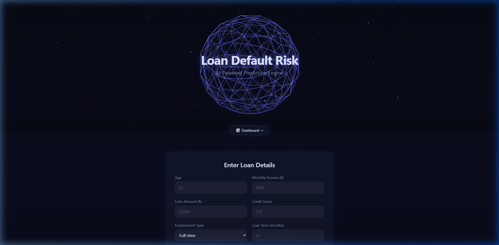
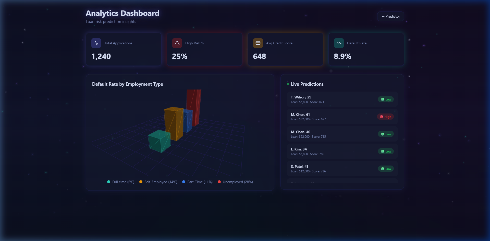
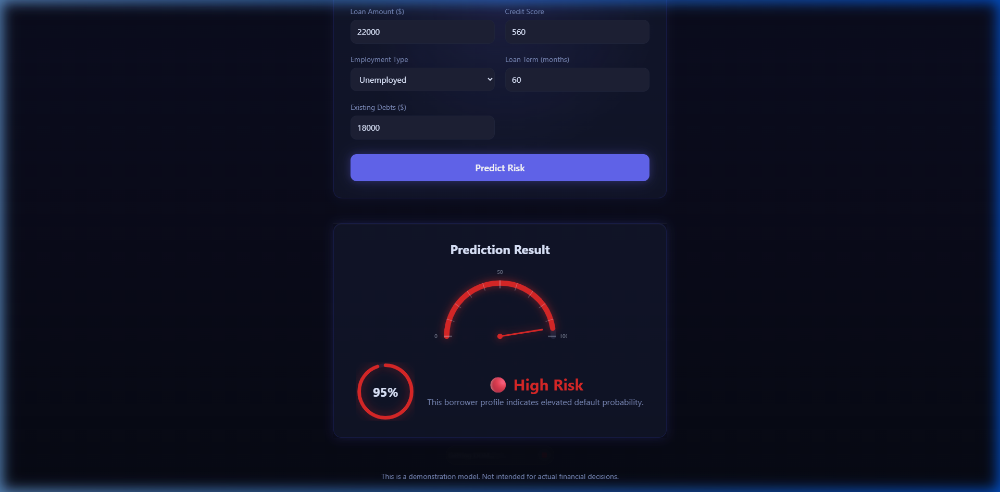

<p align="center">
  
  
  
  
  
  
</p>

<h1 align="center">✨ Sparkle Predict</h1>
<h3 align="center">AI-Powered Loan Default Risk Prediction Engine</h3>

<p align="center">
  A full-stack machine learning application that predicts the likelihood of a borrower defaulting on a loan.<br/>
  Features a cinematic React + Three.js frontend with gravity-defying animations and a production-ready FastAPI + scikit-learn backend.
</p>

---

<p align="center">
  
</p>

---

## 📋 Table of Contents

| # | Section |
|---|---|
| 01 | [Overview](#-overview) |
| 02 | [Screenshots](#-screenshots) |
| 03 | [How It Works](#️-how-it-works) |
| 04 | [Architecture](#-architecture) |
| 05 | [Tech Stack](#-tech-stack) |
| 06 | [Getting Started](#-getting-started) |
| 07 | [ML Pipeline](#-ml-pipeline) |
| 08 | [API Reference](#-api-reference) |
| 09 | [Project Structure](#-project-structure) |
| 10 | [Animation & Visual Effects](#-animation--visual-effects) |
| 11 | [Testing](#-testing) |
| 12 | [Use Cases](#-use-cases) |
| 13 | [Contributing](#-contributing) |
| 14 | [License](#-license) |

---

## 🎯 Overview

**Sparkle Predict** is a loan default risk prediction system that combines machine learning with an immersive, visually stunning web interface. It allows users to input borrower details — such as age, income, credit score, employment type, loan amount, and existing debts — and instantly receive an AI-generated risk assessment with detailed factor analysis.

### Key Highlights

- 🤖 **Machine Learning Engine** — Trains and compares Logistic Regression, Random Forest, and Gradient Boosting models; automatically selects the best performer by ROC-AUC
- 🌐 **3D Interactive Interface** — Three.js-powered wireframe globe with orbiting particles as the hero section
- 🎬 **Cinematic Animations** — Page-load float-up, gravity-defying result reveal, elastic dashboard bounce, and canvas starfield background
- 📊 **Analytics Dashboard** — Real-time stat cards, interactive 3D bar chart, and live prediction feed
- 🔌 **REST API** — Production-ready FastAPI backend with Pydantic validation, CORS, and health checks
- 🧪 **Fully Tested** — Unit tests for the ML pipeline and API endpoints with pytest

---

## 📸 Screenshots

<table>
  <tr>
    <td width="50%">
      
      <p align="center"><strong>Home — Prediction Engine</strong></p>
    </td>
    <td width="50%">
      
      <p align="center"><strong>Analytics Dashboard</strong></p>
    </td>
  </tr>
  <tr>
    <td colspan="2">
      
      <p align="center"><strong>Risk Prediction Result with Gauge & Factors</strong></p>
    </td>
  </tr>
</table>

---

## ⚙️ How It Works

The application follows a three-stage pipeline:

### 1. Data Generation & Preprocessing
A synthetic loan dataset of **5,000 borrower profiles** is generated with realistic distributions for age, income, loan amounts, credit scores, employment statuses, and existing debts. A risk score is computed using weighted features (employment risk, credit risk, debt burden, loan burden) to determine the binary default label.

**Feature engineering** adds four derived columns:
| Feature | Formula |
|---|---|
| `debt_to_income` | `existing_debts / income` |
| `loan_to_income` | `loan_amount / income` |
| `monthly_payment` | Amortization formula at 8% annual rate |
| `payment_to_income` | `monthly_payment / (income / 12)` |

### 2. Model Training & Selection
Three classifiers are trained and evaluated using **5-fold Stratified Cross-Validation** with **SMOTE oversampling** to handle class imbalance:

| Model | Strategy |
|---|---|
| **Logistic Regression** | Linear baseline with L2 regularization |
| **Random Forest** | 200 trees, max depth 10, balanced class weights |
| **Gradient Boosting** | 150 estimators, learning rate 0.1 |

The model with the **highest average ROC-AUC** across folds is automatically selected, retrained on the full SMOTE-resampled dataset, and serialized to `models/loan_model.pkl`.

### 3. Real-Time Prediction
When a user submits borrower details through the front-end form:
1. Input is validated and features are engineered (matching training-time transformations)
2. The trained model outputs a default probability
3. Risk factors are derived based on credit score, debt ratios, employment, and model confidence
4. The result is displayed with an animated semicircular gauge, progress ring, and risk classification

---

## 🏗 Architecture

```
┌──────────────────────────────────────────────────────────────┐
│                        FRONTEND                              │
│                                                              │
│  React 18 + TypeScript + Vite + Three.js + TailwindCSS      │
│                                                              │
│  ┌──────────────┐  ┌──────────────┐  ┌──────────────────┐   │
│  │  ThreeHero    │  │  Prediction  │  │  Result Panel    │   │
│  │  (3D Globe)   │  │  Form        │  │  (Gauge + Ring)  │   │
│  └──────────────┘  └──────┬───────┘  └────────▲─────────┘   │
│                           │                    │             │
│  ┌──────────────────────────────────────────────────────┐   │
│  │              Analytics Dashboard                      │   │
│  │  ┌────────────┐ ┌──────────┐ ┌───────────────┐       │   │
│  │  │ Stat Cards │ │ 3D Chart │ │ Live Feed     │       │   │
│  │  └────────────┘ └──────────┘ └───────────────┘       │   │
│  └──────────────────────────────────────────────────────┘   │
└──────────────────────┬───────────────────────────────────────┘
                       │  HTTP / REST
┌──────────────────────▼───────────────────────────────────────┐
│                        BACKEND                               │
│                                                              │
│  FastAPI + Pydantic + Uvicorn                                │
│                                                              │
│  POST /predict  ──▶  predict_loan_risk()                     │
│  GET  /health   ──▶  model status check                      │
│                         │                                    │
│                    ┌────▼─────┐                               │
│                    │  Model   │  scikit-learn                 │
│                    │  (.pkl)  │  + SMOTE + Feature Eng.       │
│                    └──────────┘                               │
└──────────────────────────────────────────────────────────────┘
```

---

## 🛠 Tech Stack

### Frontend
| Technology | Purpose |
|---|---|
| **React 18** | Component-based UI framework |
| **TypeScript** | Type-safe JavaScript |
| **Vite** | Lightning-fast dev server & bundler |
| **Three.js** | 3D wireframe globe and bar chart visualizations |
| **TailwindCSS** | Utility-first styling with custom design tokens |
| **Radix UI / shadcn** | Accessible, composable UI primitives |
| **React Router** | Client-side page routing |
| **TanStack Query** | Server state management |
| **Lucide React** | Icon library |

### Backend
| Technology | Purpose |
|---|---|
| **Python 3.11+** | Core runtime |
| **FastAPI** | High-performance async REST API framework |
| **Pydantic** | Request/response validation with type safety |
| **scikit-learn** | ML model training and prediction |
| **imbalanced-learn** | SMOTE oversampling for class imbalance |
| **pandas / NumPy** | Data manipulation and numerical computation |
| **joblib** | Model serialization/deserialization |
| **Uvicorn** | ASGI server for production deployment |

### Testing & Tooling
| Technology | Purpose |
|---|---|
| **Vitest** | Frontend unit testing |
| **pytest** | Backend unit and integration testing |
| **ESLint** | JavaScript/TypeScript linting |
| **httpx** | Async HTTP client for API tests |

---

## 🚀 Getting Started

### Prerequisites

- **Node.js** 18+ and **npm** (or **bun**)
- **Python** 3.11+
- **pip** (Python package manager)

### 1. Clone the Repository

```bash
git clone https://github.com/pushkarsingh26/loan-risk-prediction.git
cd loan-risk-prediction
```

### 2. Install Frontend Dependencies

```bash
npm install
```

### 3. Install Python Dependencies

```bash
pip install -r requirements.txt
```

### 4. Generate Data & Train the Model

```bash
# Generate synthetic loan dataset (saves to data/loan_data.csv)
python src/preprocess.py

# Train models and save best to models/loan_model.pkl
python src/train_model.py
```

### 5. Start the Development Servers

**Frontend** (Vite dev server):
```bash
npm run dev
# → http://localhost:8080
```

**Backend** (FastAPI server):
```bash
python app/api.py
# → http://localhost:8000
# → Docs at http://localhost:8000/docs
```

> **Note:** The frontend includes a built-in mock prediction engine for demonstration purposes. The backend API is optional and provides the full ML model prediction.

---

## 🧠 ML Pipeline

### Data Pipeline

```
preprocess.py                    train_model.py
────────────                     ──────────────
Generate 5,000 synthetic    ──▶  Load & clean data
borrower profiles                     │
    │                            Label-encode employment
    │                                 │
Save to data/loan_data.csv      Engineer 4 derived features
                                      │
                                 5-fold Stratified CV + SMOTE
                                      │
                                 Compare 3 classifiers
                                      │
                                 Select best by ROC-AUC
                                      │
                                 Retrain on full dataset
                                      │
                                 Save to models/loan_model.pkl
```

### Model Evaluation Metrics

The training script outputs a comparison table like:

| Model | Accuracy | Precision | Recall | F1 | ROC-AUC |
|---|---|---|---|---|---|
| GradientBoosting | 0.93 | 0.85 | 0.78 | 0.81 | 0.96 |
| RandomForest | 0.92 | 0.83 | 0.76 | 0.79 | 0.95 |
| LogisticRegression | 0.88 | 0.72 | 0.65 | 0.68 | 0.91 |

> *Exact values depend on random state and data generation.*

### Risk Factor Analysis

The prediction engine doesn't just output a probability — it explains **why** a borrower is risky:

- 🔴 **Low credit score** (< 620)
- 🔴 **High existing debt relative to income** (DTI > 40%)
- 🔴 **Large loan amount compared to income** (LTI > 45%)
- 🔴 **Unemployed status** increases repayment uncertainty
- 🟡 **Below-average credit score** (620–680)
- 🟡 **Moderately high debt burden** (DTI 30–40%)

---

## 📡 API Reference

### Health Check

```http
GET /health
```

**Response:**
```json
{
  "status": "ok",
  "model": "loaded"
}
```

### Predict Loan Risk

```http
POST /predict
Content-Type: application/json
```

**Request Body:**
```json
{
  "age": 25,
  "income": 28000,
  "loan_amount": 22000,
  "credit_score": 560,
  "employment_status": "Unemployed",
  "loan_term": 60,
  "existing_debts": 18000
}
```

**Response:**
```json
{
  "risk_label": "High Risk",
  "probability": 0.89,
  "risk_score": 89,
  "risk_factors": [
    "Low credit score",
    "High existing debt relative to income",
    "Unemployed status increases repayment uncertainty"
  ]
}
```

### Input Constraints

| Field | Type | Constraints |
|---|---|---|
| `age` | int | 18 – 100 |
| `income` | float | > 0 |
| `loan_amount` | float | > 0 |
| `credit_score` | int | 300 – 850 |
| `employment_status` | string | Non-empty |
| `loan_term` | int | > 0 (months) |
| `existing_debts` | float | ≥ 0 |

---

## 📂 Project Structure

```
sparkle-predict/
├── app/
│   └── api.py                  # FastAPI REST endpoints
├── data/
│   └── loan_data.csv           # Generated synthetic dataset (5,000 rows)
├── docs/
│   └── screenshots/            # README screenshots
├── models/
│   └── loan_model.pkl          # Trained model artifact
├── src/
│   ├── config.py               # Centralized ML pipeline configuration
│   ├── preprocess.py           # Synthetic data generation & feature engineering
│   ├── predict.py              # Prediction logic with risk factor derivation
│   ├── train_model.py          # Model training, evaluation & selection
│   ├── App.tsx                 # React app root with routing
│   ├── main.tsx                # React entry point
│   ├── index.css               # Design system (glassmorphism, animations, tokens)
│   ├── components/
│   │   ├── ThreeHero.tsx       # Three.js wireframe globe hero section
│   │   ├── PredictionForm.tsx  # 7-field loan input form with tilt effect
│   │   ├── ResultPanel.tsx     # Animated gauge, ring, particles result display
│   │   ├── NavLink.tsx         # Navigation link component
│   │   ├── dashboard/
│   │   │   ├── FloatingStatCards.tsx  # KPI stat cards with bounce entrance
│   │   │   ├── BarChart3D.tsx        # Three.js 3D bar chart
│   │   │   ├── LiveFeedPanel.tsx     # Real-time prediction feed
│   │   │   └── Starfield.tsx         # Canvas particle starfield background
│   │   └── ui/                 # shadcn/Radix UI primitives
│   └── pages/
│       ├── Index.tsx           # Home page (hero + form + results)
│       ├── Dashboard.tsx       # Analytics dashboard
│       └── NotFound.tsx        # 404 page
├── tests/
│   ├── conftest.py             # Shared pytest fixtures
│   ├── test_api.py             # API endpoint tests
│   └── test_pipeline.py        # ML pipeline unit tests
├── package.json                # Node.js dependencies & scripts
├── requirements.txt            # Python dependencies
├── vite.config.ts              # Vite bundler configuration
├── tailwind.config.ts          # TailwindCSS theme extension
├── tsconfig.json               # TypeScript configuration
└── vitest.config.ts            # Vitest test configuration
```

---

## 🎨 Animation & Visual Effects

Sparkle Predict features four signature visual effects:

| # | Effect | Description |
|---|---|---|
| **FX 01** | **Page Load Float-Up** | All major sections rise from 60px below with staggered delays (0–840ms), blur dissolution, and a gentle overshoot bounce |
| **FX 02** | **Gravity-Defying Result Reveal** | The prediction card launches from 120px below with scale + rotateX transforms, overshoots by 24px, settles with a glowing box-shadow burst |
| **FX 03** | **Dashboard Bounce Entrance** | Stat cards and chart panels enter with an elastic cubic-bezier curve (0.34, 1.56, 0.64, 1), each staggered 150ms apart |
| **FX 04** | **Starfield Background** | 120 canvas-rendered particles drift upward at varying speeds with horizontal wobble and multi-colored glow halos (indigo, purple, teal, white-blue) |

Additional micro-interactions:
- 🃏 **3D Card Tilt** — Prediction form responds to mouse movement with perspective transforms and a specular highlight
- 🔮 **Wireframe Globe** — Three.js icosahedron rotates with sine-wave pulsing and orbiting particles
- 📊 **Bar Growth** — 3D chart bars animate from zero height with easeOutCubic easing
- 🔴 **Particle Burst** — Canvas particle explosion on result reveal (red for high risk, green for low risk)
- 📈 **Animated Counters** — Risk percentage counts up with easeOutCubic interpolation
- 🎯 **Gauge Needle** — SVG semicircular gauge sweeps to the risk value with glow effects

---

## 🧪 Testing

### Frontend Tests
```bash
npm run test          # Single run
npm run test:watch    # Watch mode
```

### Backend Tests
```bash
pytest tests/ -v
```

Test coverage includes:
- ✅ Synthetic data generation and shape validation
- ✅ Feature preprocessing and engineering
- ✅ Model training and evaluation metrics
- ✅ API endpoint request/response validation
- ✅ Health check with model status
- ✅ Edge cases: invalid inputs, missing model file

---

## 💡 Use Cases

| Audience | Use Case |
|---|---|
| **Banks & NBFCs** | Pre-screen loan applicants to flag high-risk profiles before manual review |
| **Fintech Startups** | Embed risk scoring into digital lending platforms |
| **Credit Analysts** | Understand which factors contribute most to default probability |
| **Students & Learners** | Study a complete ML pipeline from data generation → training → deployment → UI |
| **Portfolio Projects** | Demonstrate full-stack skills: React, Three.js, FastAPI, scikit-learn, and DevOps |

---

## 🤝 Contributing

Contributions are welcome! Here's how to get started:

1. **Fork** the repository
2. **Create** a feature branch: `git checkout -b feature/amazing-feature`
3. **Commit** your changes: `git commit -m "Add amazing feature"`
4. **Push** to the branch: `git push origin feature/amazing-feature`
5. **Open** a Pull Request

### Development Guidelines

- Follow the existing code style and naming conventions
- Add tests for new features
- Update this README for user-facing changes
- Keep commits atomic and well-described

---

## 📜 License

This project is open-source and available under the [MIT License](LICENSE).

---

<p align="center">
  Built with ❤️ using React, Three.js, FastAPI & scikit-learn
</p>
